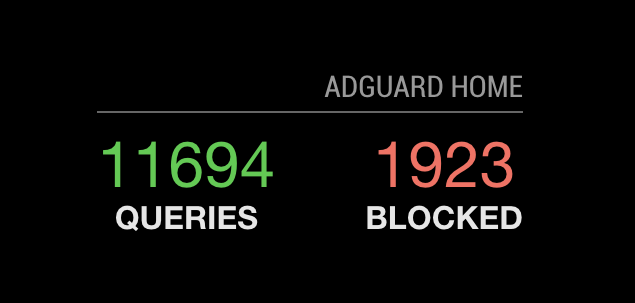

# MMM-AdGuard-Home

This a module for the [MagicMirror](https://github.com/MichMich/MagicMirror).

MagigMirror module to get AdGuard Home stats.



## Installation

```bash
git clone https://github.com/ryck/MMM-AdGuard-Home.git
cd MMM-AdGuard-Home
npm install
```

## Config

The entry in `config.js` can include the following options:

| Option             | Description                                                                                                                                                                                                                                      |
| ------------------ | ------------------------------------------------------------------------------------------------------------------------------------------------------------------------------------------------------------------------------------------------ |
| `api`              | **Required** IP (or host) of your AdGuard Home instance<br>**Type:** `string`<br>**Example values:** `192.168.1.32`, `adguard.local`, etc...<br> **Default value:** `null`                                                                       |
| `token`            | **Required** API token (base64-encoded data for username:password) ([see github.com/AdguardTeam/AdGuardHome/tree/master/openapi](http://https://github.com/AdguardTeam/AdGuardHome/tree/master/openapi))<br>**Type:** `string`                   |
| `updateInterval`   | How often the data is updated. (Milliseconds)<br>**Type:** `integer`<br>**Default value:** `1 * 60 * 1000` (1 minute)                                                                                                                            |
| `initialLoadDelay` | The initial delay before loading. If you have multiple modules that use the same API key, you might want to delay one of the requests. (Milliseconds)<br>**Type:** `integer`<br>**Possible values:** `1000` - `5000` <br> **Default value:** `0` |
| `animationSpeed`   | Speed of the update animation. (Milliseconds)<br>**Type:** `integer`<br>**Possible values:**`0` - `5000` <br> **Default value:** `1000` (1 second)                                                                                               |
| `debug`            | Show debug information.<br>**Type:** `boolean`<br>**Possible values:** `true` or `false` <br> **Default value:** `false`                                                                                                                         |

Here is an example of an entry in `config.js`

```
		{
			module: 'MMM-AdGuard-Home',
			position: 'bottom_left',
			header: 'AdGuard Home',
			config: {
				api: "192.168.1.32",
				token: "QWRHdWFyZCBIb21l",
				updateInterval: 5 * 60 * 1000, // Every five minutes.
				initialLoadDelay: 0,
				animationSpeed: 1000,
				debug: false
			}
		},
```

## Get your token

Your token is just base64-encoded data for username:password string.

## Dependencies

- [request](https://www.npmjs.com/package/request) (installed via `npm install`)

## Thanks To...

- The [AdGuard Home](https://github.com/AdguardTeam/AdGuardHome) team for creating such a great tool (and include an API to use it!).
- [Michael Teeuw](https://github.com/MichMich) for the [MagicMirror2](https://github.com/MichMich/MagicMirror/) framework that made this module possible.
